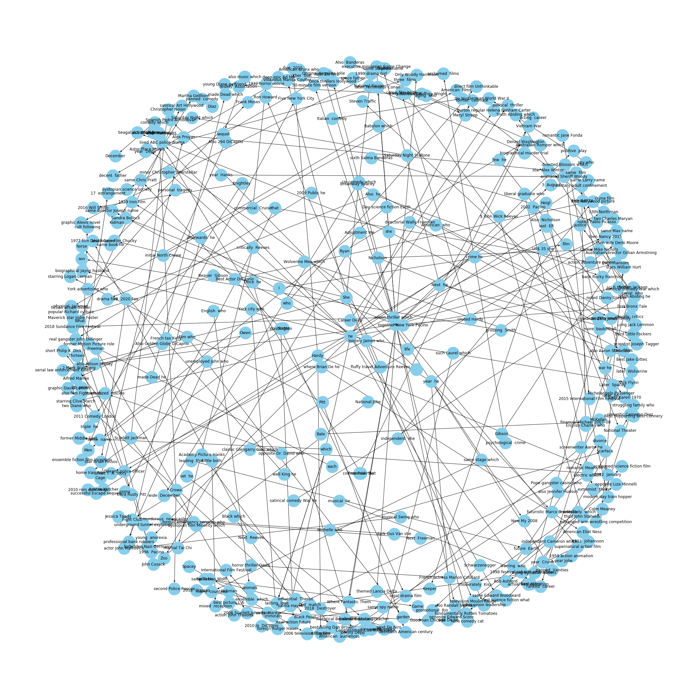
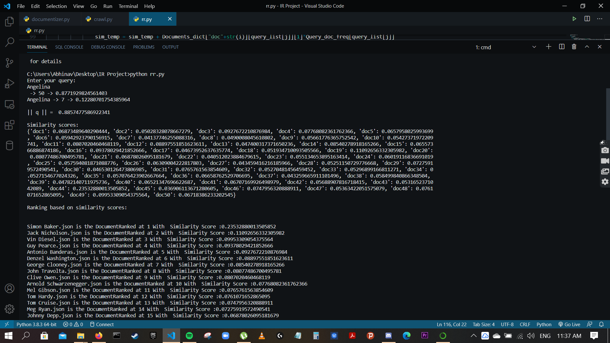
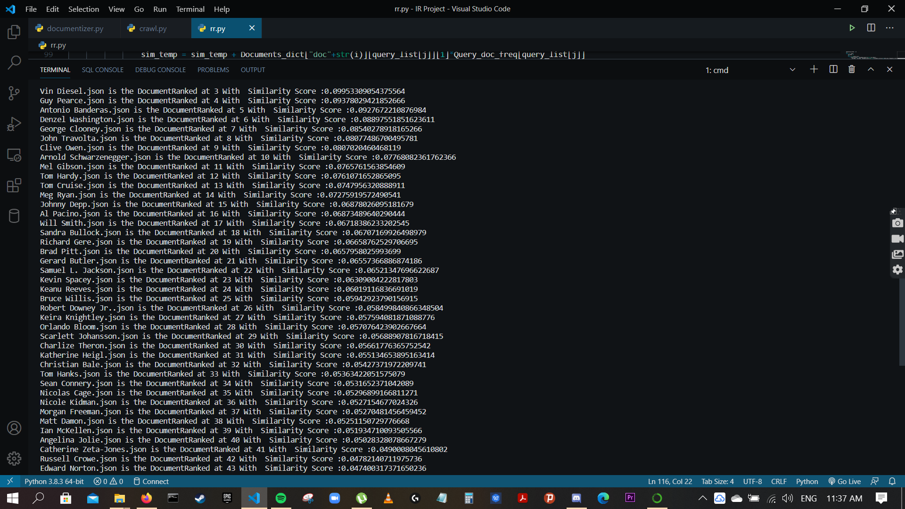
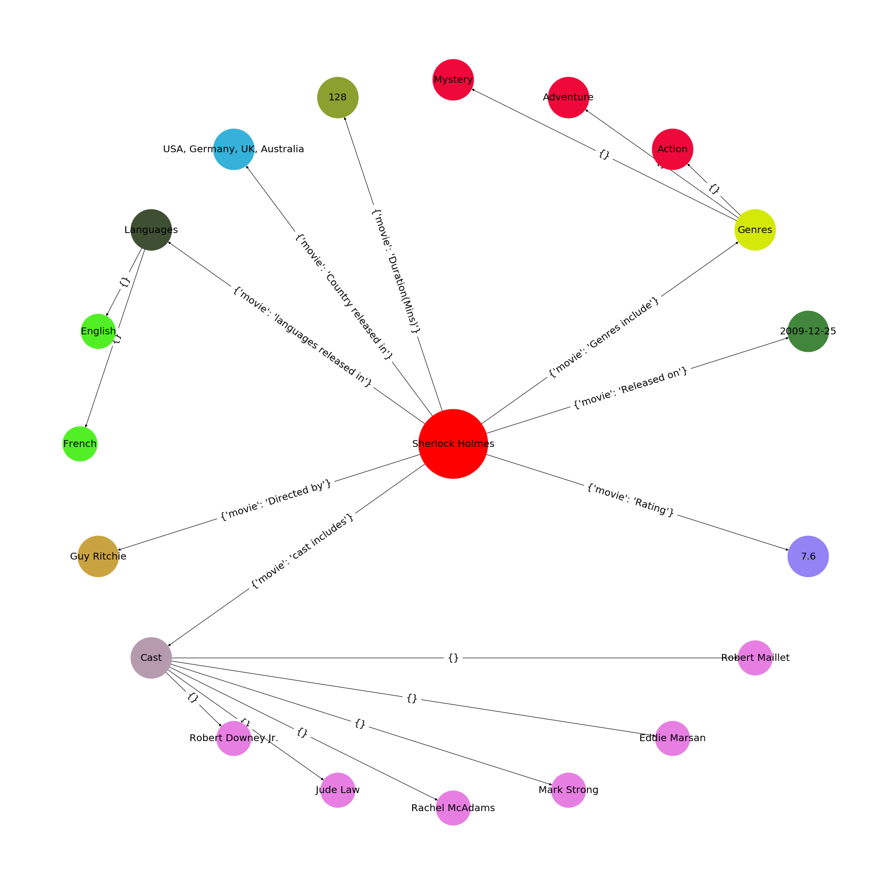

# The Entertainment Knowledge Graph

An IR project based on Knowledge Graph Structures for movies and actors/actresses analysis. 

# Group Members

1. Abhinav Talari (S20180010003)
2. Utkarsh Ajay Aditya (S20180010182)

# Project Details

<b><u>Project Title</u></b>: The Entertainment Knowledge Graph 

<b><u>Domain of Project</u></b>:  Entertainment (Movies, television programs and celebrity content

## Project Description

This project focuses on end-to-end utilization of knowledge graphs and semantics in the field of entertainment. Our entities include movies, tv shows, actors/actresses and all their attributes and relationships. Our project is based on entity ranking, entity linking, entity-based retrieval models, entity recommendation, document filtering and knowledge graph population. The knowledge graph will represent movies and tv shows as well as actors, genres and the complex interrelationships among them, which will help us retrieve more informational value compared to free text.

# Algorithms/Approaches Used

Individual Breakdown for each member.

## 1. Abhinav Talari(S20180010003) Tasks

### A. Web Scraping(Actors/Actresses data)

<b><u>Associated Files</u></b>: Scraper_For_Actors.py   

This python code file is used for scraping actor data from Wikipedia and storing it.    
Scraped Data from Wikipedia by Even going through the underlying links which increased the corpus exhaustively

The Functions Used :   
<b>1. wiki_scrape(page)</b>
This Looks for a page on Wikipedia
extracts it,parses it and the underlying link and keeps on fetching data from those links. 

<b><u>For Example</u></b> for a query as wiki_scrape("Robert Downey Jr.") Made it crawl 800+ links

<b>2. wiki_page(page)</b>
This just fetches the data from the very first hit it gets on Wikipedia
the query for this function needs to be very precise

<b><u>For Example</u></b> wiki_page("The Avengers") will not fetch the movie synopsis of the MCU's Avengers but just links and names of other movies/entities with the same name or context.

### B. Knowledge Graph for Actors
<b><u>Associated Files</u></b>: Knowledge_Graph_for_Actors.py      

Based on the data crawled and collected for Actors and Movies , I created a knowledge graph to perform "Entity-Entity pair based on Relation" Query.   

The sentences were tokenized and the Entity-Relation-Entity were identified and put into the Knowledge Graph   
The knowledge graph was visualized using Networkx   

<b><u>Output</u></b>:Below is the knowledge graph representing top 250 actors along with their extracted entities (subject-object pairs) and the predicates (relation between entities).      
   
The networkx library was used to create a network from this data frame. The nodes will represent the entities and the edges or connections between the nodes will represent the relations between the nodes.   
It is going to be a directed graph. In other words, the relation between any connected node pair is not two-way, it is only from one node to another. For example, “John eats pasta”

The above figure represents a sub-knowledge graph based on the relation "starred in" for actors. 

### C. Ranked Retrieval model(Actors)
<b><u>Associated Files</u></b>: RankedRetrieval_actors.py   
Based on the Data Scraped I created a Ranked Retrieval System using tf-idf ranking.  
Since the Boolean Model only fetches complete matches, it doesn’t address the problem of the documents being partially matched. The Vector Space Model solves this problem by introducing vectors of index items each assigned with weights. The weights are ranged from positive (if matched completely or to some extent) to negative (if unmatched or completely oppositely matched) if documents are present. Term Frequency - Inverse Document Frequency (tf-idf) is one of the most popular techniques where weights are terms (e.g. words, keywords, phrases etc.) and dimensions is number of words inside corpus. 
Therefore I created a ranked retrieval based on tf-idf ranking

<b><u>Output</u></b>

1. Below is the output showing for the query "Angelina Jolie"

## 2.Utkarsh Ajay Aditya(S20180010182) Tasks

### A. Web Scraping(Movies)
<b><u>Associated Files</u></b>: imdb_moviedata_scrape.py   
The above code is used for scraping movie details of over 83,000 movies and storing it in final_dataset.csv
The collected fields for a given movie were:  
Title, Date, Run Time, Genre, Rating Score, Description, Director, Stars, VotesGross   
    

### B. Knowledge Graph for Movies

<b><u>Associated Files</u></b>: KnowledgeGraph_movies_recommender_system.py 

It works on the basis of final_dataset_imdb.csv.  

**NOTE** :  All the graphs would be saved as .pdf file in the code directory. One has to view the pdf file where he can zoom and every node will be visible in HD resolution.     
The above code file defines 3 different types of knowledge graph structures related to movies:   

#### 1. Movie detail graph for a single movie  

 

The above figure shows the detailed view of a given movie name showing all its details like director, cast, release date, etc.

#### 2. Movie Comparison graph between two movies.   

The above figure shows the comparison between 2 input movie names on basis of genre, languages and director.

#### 3.Knowledge graph of 1000 movies. 

The blue nodes near the edges of the graph represent genres, edges of same color represent same genre movies.   

A movie node's color is derived by the combination of its genres color. Therefore movies with similar characteristics would be of same color and in the same color.    

Properties of graph : 

a. There is homogeneity between the movies belonging to the same color. (Represented by same color.)

b. There is heterogeneity among  movies from different clusters. (Represented by different colors.)

Zoomed pic of a cluster.

  

​     Here you can see the movies which belong to different colors. Each color represents a color.   

Such a graph provides us insight about what movie an user can like based on few of his judgments. 

### C. Movie Recommendation System

<b><u>Associated Files</u></b>: KnowledgeGraph_movies_recommender_system.py

Given a movie name it will return a list of top 10 similar movies along with their matching scores.   

It is based on an empirically derived ranking system which takes into account all the movie details like genres, crew,

director, writer, year, other user reviews, etc. 

**Example** : For movie - The Avengers

**Example :** For movie mission impossible

 

 

### D. Spell Correction for the entertainment domain

<b><u>Associated Files</u></b>: KnowledgeGraph_movies_recommender_system.py

Entertainment_domain_spell_correction.py is an autocorrect program file to correct incorrect 
		a) movie name or TV series name
		b) actors/actresses name
		c) director/write name

**Example** For query "Robept Downez" and another query "emmg watsoz"

**Implementation of spell checker**

1) Store Dictionary in Trie
2) Query is processed word by word.
3) If word is in dictionary, move ahead.
4) If word is not in dictionary, display the candidate set.
5) Also display the post probable candidate by calculating the posterior probability 

# References

1. Wikipedia
2. IMDB
3. networkx
4. **Research Paper** :  Knowledge Graphs: An Information Retrieval Perspective

